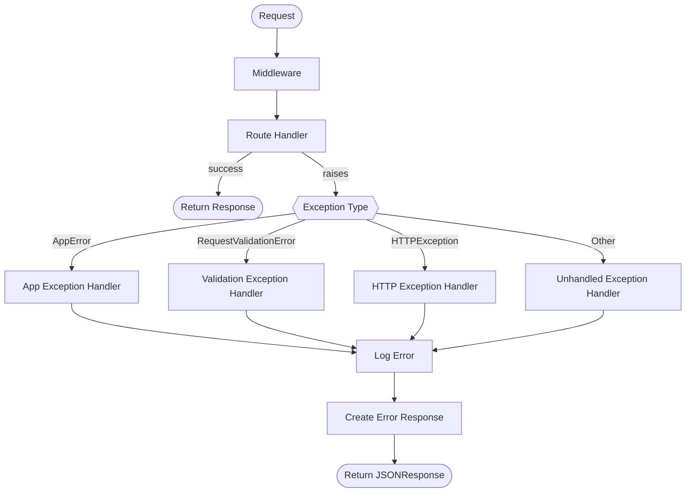

<div align="center">

# FastAPI Global Exception Handling

**A production-ready reference implementation of centralized, structured exception handling in FastAPI.**

[](https://www.python.org/)
[](https://fastapi.tiangolo.com/)
[](https://docs.astral.sh/ruff/)
[](https://mypy-lang.org/)
[](https://pre-commit.com/)
[](LICENSE)

</div>

---

## 📋 Table of Contents

- [FastAPI Global Exception Handling](#fastapi-global-exception-handling)
  - [📋 Table of Contents](#-table-of-contents)
  - [🔍 Overview](#-overview)
  - [✨ Features](#-features)
  - [📁 Project Structure](#-project-structure)
  - [🚀 Getting Started](#-getting-started)
    - [📦 Prerequisites](#-prerequisites)
    - [⚙️ Installation](#️-installation)
    - [▶️ Running the Server](#️-running-the-server)
  - [📄 Error Response Format](#-error-response-format)
  - [⚠️ Custom Exceptions](#️-custom-exceptions)
  - [🛡️ Exception Handlers](#️-exception-handlers)
  - [🔄 Exception Handling Workflow](#-exception-handling-workflow)
  - [🔌 API Routes](#-api-routes)
  - [🧪 Testing](#-testing)
  - [🔬 Code Quality](#-code-quality)
  - [📚 Further Reading](#-further-reading)
    - [⚡ FastAPI \& Starlette](#-fastapi--starlette)
    - [🔧 Error Handling \& API Design](#-error-handling--api-design)
    - [📝 Logging](#-logging)
  - [🤝 Feedback \& Contributing](#-feedback--contributing)
  - [📜 License](#-license)

---

## 🔍 Overview

This project demonstrates how to implement **global, centralized exception handling** in a [FastAPI](https://fastapi.tiangolo.com/) application following architecture best practices.

Instead of scattering `try/except` blocks across routes, all errors flow through a single, consistent pipeline that:

1. Catches every exception type (custom, HTTP, validation, unhandled)
2. Logs it with full structured context via [Loguru](https://github.com/Delgan/loguru)
3. Returns a predictable, machine-readable JSON error response to the client

---

## ✨ Features

- **Centralized exception handlers** registered once on the FastAPI app
- **Custom exception hierarchy** — `AppError` base with typed subclasses
- **Consistent error response schema** — every error returns the same JSON shape
- **Structured logging** with [Loguru](https://github.com/Delgan/loguru), including request context (method, path, IP, user-agent)
- **Request logging middleware** with per-request duration tracking
---

## 📁 Project Structure

```
fastapi-global-exception-handling/
├── app/
│   ├── api.py                  # API routes (root + error simulation endpoints)
│   ├── exception_handlers.py   # Global exception handlers + registration
│   ├── exceptions.py           # Custom exception hierarchy (AppError subclasses)
│   ├── logging.py              # Loguru setup, stdlib logging bridge
│   ├── main.py                 # FastAPI app instance, lifespan, wiring
│   ├── middleware.py           # Request logging middleware
│   ├── schemas.py              # Pydantic models (ErrorDetail, ErrorResponse)
│   └── utils.py                # RequestInfo dataclass + helper
├── tests/
│   ├── conftest.py             # Shared TestClient fixture
│   └── test_error_routes.py    # Integration tests for API routes (34 tests)
├── pyproject.toml              # Project metadata, dependencies, tool config
├── .pre-commit-config.yaml     # Pre-commit hooks (ruff, mypy)
└── LICENSE
```

---

## 🚀 Getting Started

### 📦 Prerequisites

- Python **3.13+**
- [uv](https://docs.astral.sh/uv/) (recommended) or `pip`

### ⚙️ Installation

```bash
# Clone the repository
git clone https://github.com/mouakos/fastapi-global-exception-handling.git
cd fastapi-global-exception-handling

# Create virtual environment and install dependencies
uv sync
```

### ▶️ Running the Server

```bash
uv run uvicorn app.main:app --reload
```

The API will be available at `http://127.0.0.1:8000`.  
Interactive docs: `http://127.0.0.1:8000/docs`

---

## 📄 Error Response Format

Every error — regardless of its type — returns the same JSON structure:

```json
{
  "error": {
    "code": "NOT_FOUND",
    "message": "Item with ID 123 not found.",
    "details": {
      "resource": "Item",
      "resource_id": "123"
    }
  }
}
```

| Field           | Type             | Description                       |
| --------------- | ---------------- | --------------------------------- |
| `error.code`    | `string`         | Machine-readable error identifier |
| `error.message` | `string`         | Human-readable description        |
| `error.details` | `object \| null` | Optional structured context       |

---

## ⚠️ Custom Exceptions

All custom exceptions extend `AppError`, which itself extends Python's built-in `Exception`.

```
AppError (base)
├── NotFoundError          404  NOT_FOUND
├── ValidationError        422  INVALID_INPUT
├── AuthenticationError    401  AUTHENTICATION_FAILED
├── AuthorizationError     403  PERMISSION_DENIED
├── ConflictError          409  RESOURCE_CONFLICT
└── ExternalServiceError   503  SERVICE_UNAVAILABLE
```

**Usage example:**

```python
from app.exceptions import NotFoundError, AuthorizationError

# Raise a 404
raise NotFoundError(resource="User", resource_id=42)

# Raise a 403
raise AuthorizationError(action="delete", resource="Invoice")
```

---

## 🛡️ Exception Handlers

Handlers are registered in `app/exception_handlers.py` and wired to the app via `register_exception_handlers(app)`:

| Handler                        | Catches                             | Status                 |
| ------------------------------ | ----------------------------------- | ---------------------- |
| `app_exception_handler`        | `AppError` and all subclasses       | Derived from exception |
| `validation_exception_handler` | `RequestValidationError` (Pydantic) | `422`                  |
| `http_exception_handler`       | `StarletteHTTPException`            | Derived from exception |
| `unhandled_exception_handler`  | `Exception` (catch-all)             | `500`                  |

All handlers log with full request context and produce the standard `ErrorResponse`.

---

## 🔄 Exception Handling Workflow



---

## 🔌 API Routes

| Method | Path                      | Simulates                    |
| ------ | ------------------------- | ---------------------------- |
| `GET`  | `/`                       | Welcome message              |
| `GET`  | `/error/not-found`        | `404` NotFoundError          |
| `GET`  | `/error/authentication`   | `401` AuthenticationError    |
| `GET`  | `/error/authorization`    | `403` AuthorizationError     |
| `POST` | `/error/validation/item`  | `422` RequestValidationError |
| `POST` | `/error/conflict`         | `409` ConflictError          |
| `POST` | `/error/external-service` | `503` ExternalServiceError   |
| `GET`  | `/error/http`             | `400` HTTPException          |
| `GET`  | `/error/unhandled`        | `500` unhandled ValueError   |

---

## 🧪 Testing

```bash
# Run all tests
uv run pytest 
```

---

## 🔬 Code Quality

```bash
# Install pre-commit hooks (required once after cloning)
uv run pre-commit install

# Lint
uv run ruff check .

# Format
uv run ruff format .

# Type check
uv run mypy

# Run all pre-commit hooks
uv run pre-commit run --all-files
```

Pre-commit hooks run automatically on every `git commit` (Ruff lint → Ruff format → Mypy).

---

## 📚 Further Reading

### ⚡ FastAPI & Starlette
- [FastAPI Exception Handlers](https://fastapi.tiangolo.com/tutorial/handling-errors/) — Official docs on `HTTPException` and custom handlers
- [Starlette Middleware](https://www.starlette.io/middleware/) — How middleware works in the request/response lifecycle

### 🔧 Error Handling & API Design
- [How to Handle Exceptions Globally in FastAPI](https://oneuptime.com/blog/post/2026-02-02-fastapi-global-exception-handling/view) — Guide covering custom exceptions, global handlers, middleware, and consistent error responses (OneUptime Blog)
- [RFC 7807 — Problem Details for HTTP APIs](https://datatracker.ietf.org/doc/html/rfc7807) — Standard for structured HTTP error responses
- [Google API Design Guide — Errors](https://cloud.google.com/apis/design/errors) — Industry-standard error model used by Google APIs
-
### 📝 Logging
- [Loguru Documentation](https://loguru.readthedocs.io/) — Structured logging library used in this project
- [Structured Logging Best Practices](https://betterstack.com/community/guides/logging/structured-logging/) — Guide to structured, machine-readable logs

---

## 🤝 Feedback & Contributing

**Feedback & questions** — open a [GitHub Discussion](https://github.com/mouakos/fastapi-global-exception-handling/discussions) for questions, ideas, or general feedback.

**Bug reports** — open a [GitHub Issue](https://github.com/mouakos/fastapi-global-exception-handling/issues) for confirmed bugs or actionable feature requests.

---

## 📜 License

This project is licensed under the [MIT License](LICENSE).

<div align="center">

Built by [Stephane Mouako](https://github.com/mouakos)

</div>

